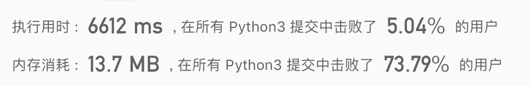

## twoSum

给定一个整数数组 nums 和一个目标值 target，请你在该数组中找出和为目标值的那两个整数，并返回他们的数组下标。
你可以假设每种输入只会对应一个答案。但是，你不能重复利用这个数组中同样的元素。

> 给定 nums = [2, 7, 11, 15], target = 9
  因为 nums[0] + nums[1] = 2 + 7 = 9
  所以返回 [0, 1]

```python
class Solution:

  def twoSum(self, nums: List[int], target: int) -> List[int]:
     for i in range(0,len(nums)) :
      	for j in range(i+1,len(nums)):
         	if nums[i] + nums[j] == target:
           	return [i,j]

```




```python
class Solution:
    def twoSum(self, nums: List[int], target: int) -> List[int]:
			d = {}
			for i, n in enumerate(nums): 
	    	if n in d: return [d[n], i]
      	d[target-n] = i
```

1. enumerte 将列表/元组/字符串转为索引序列
```python
	seq = ['one', 'two', 'three']
	for i, element in enumerate(seq):
		print i, element
```
返回值为迭代器，可以强转为list

2. in后面是字典，匹配字典里的key
键必须是唯一的，但值则不必。
创建时如果同一个键被赋值两次，后一个值会被记住
键必须不可变，所以可以用数字，字符串或元组充当，而用列表就不行
```python
d = {key1 : value1, key2 : value2 }
dict[key3] = value3 #添加信息
del dict['key1'] # 删除键 'key1'
dict.clear()     # 清空字典
del dict         # 删除字典
len(dict)        #字典键的个数
str(dict)        #{key1 : value1, key2 : value2 }
```

3. 思想是：在计算过程中，保存一些对后序遍历可能有用的信息，曾经出现过的值，可以让后续出现的元素知道它的另一半曾出现过。向后看的思想，如动态规划的备忘录，就是记录曾经遍历过的。